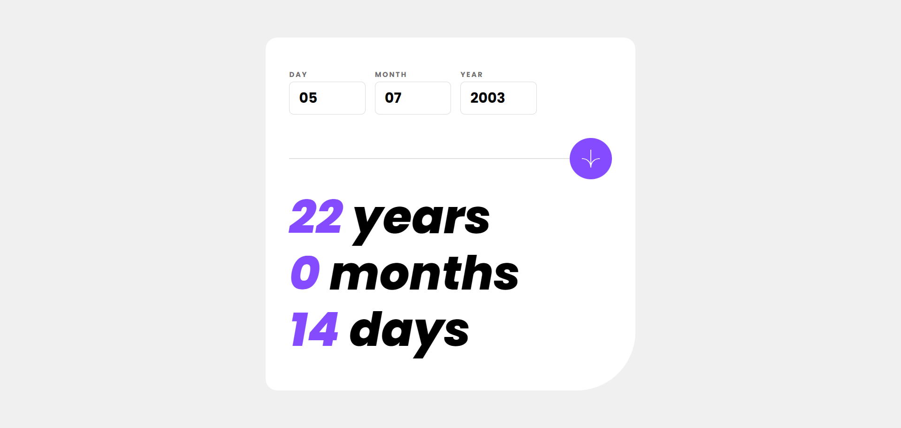

# Frontend Mentor - Age calculator app solution

This is my solution to the [Age calculator app challenge on Frontend Mentor](https://www.frontendmentor.io/challenges/age-calculator-app-dF9DFFpj-Q). Completing Frontend Mentor challenges is a great way to enhance your coding skills by working on real-world projects.

## Table of Contents

- [Overview](#overview)
  - [The Challenge](#the-challenge)
  - [Screenshot](#screenshot)
  - [Links](#links)
- [My Process](#my-process)
  - [Built With](#built-with)
  - [What I Learned](#what-i-learned)

## Overview

### The Challenge

Users can:

- View their age in years, months, and days after submitting a valid date
- Receive validation errors if:
  - Any field is left empty on submission
  - The day is not between 1–31
  - The month is not between 1–12
  - The year is in the future
  - The date is invalid (e.g., 31/04/1991, since April has only 30 days)
- Experience a responsive layout optimized for any device
- See hover and focus states for all interactive elements
- **Bonus:** Watch the age numbers animate to their final values when the form is submitted

### Screenshot

### Links

- Solution URL:
- Live Site URL: https://dorm-24.github.io/age-calculator-app/

## My Process

### Built With

- Semantic HTML5 markup
- CSS custom properties
- Flexbox
- CSS Grid
- Mobile-first workflow

### What I Learned

This project helped me improve my skills in working with dates and writing cleaner, more maintainable code.